# RFEM AI Agent - Architecture Documentation

## 1. High-Level System Architecture

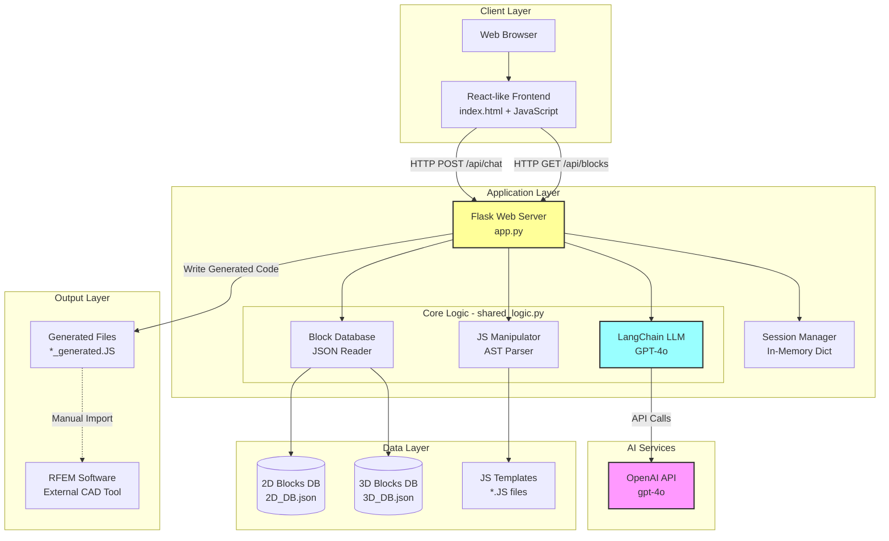

## 2. Conversation Flow State Machine

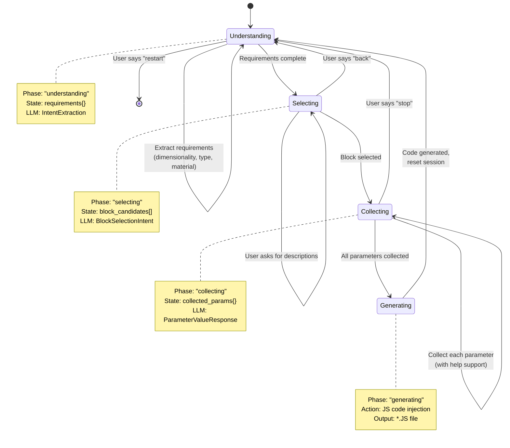

## 3. Data Flow Architecture

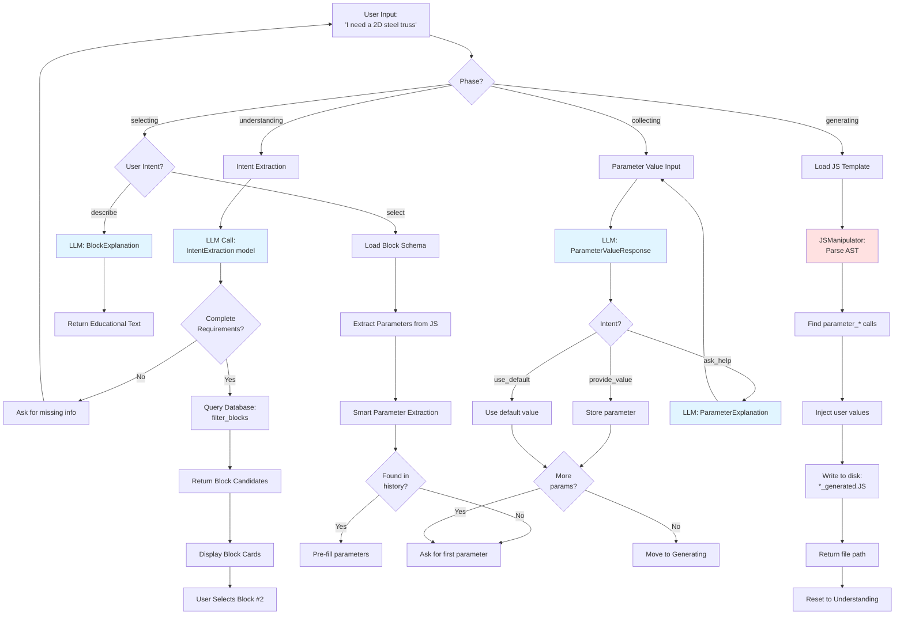

## 4. Component Architecture (Detailed)

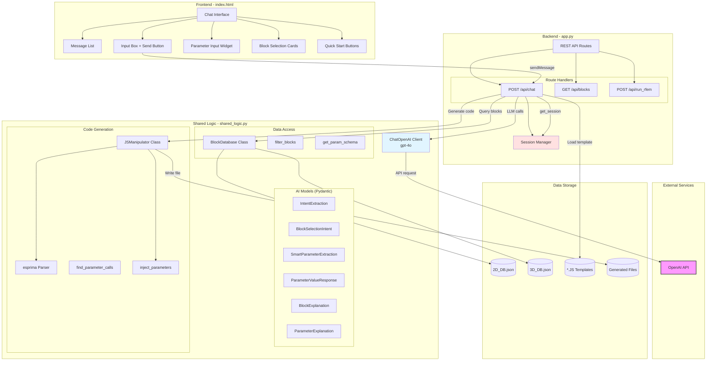

## 5. Session State Structure

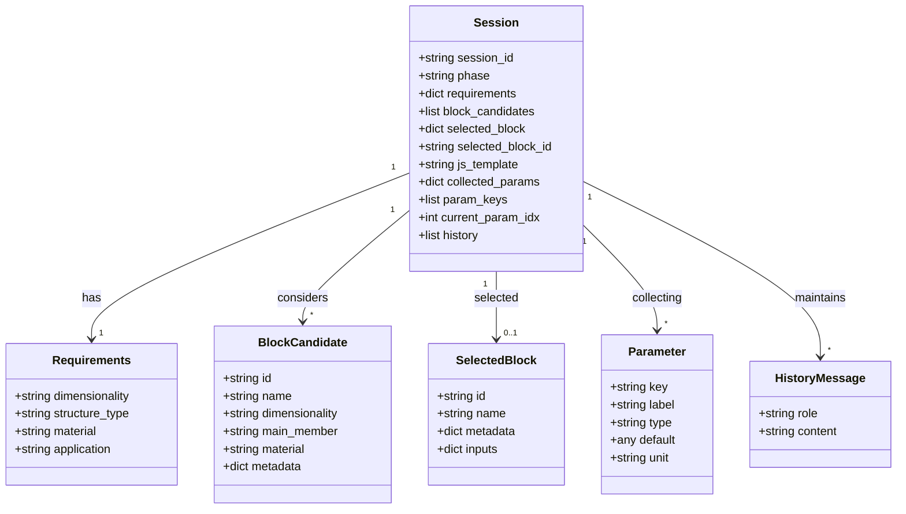

## 6. LLM Integration Architecture

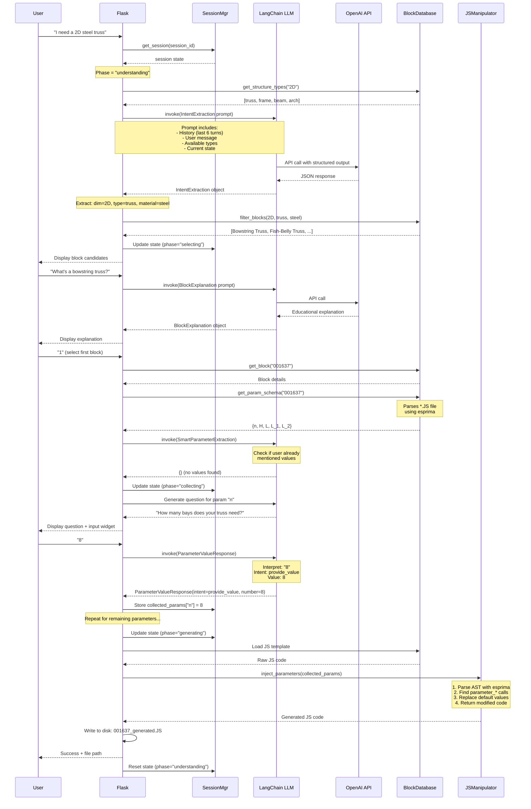

## 7. Database Schema Architecture

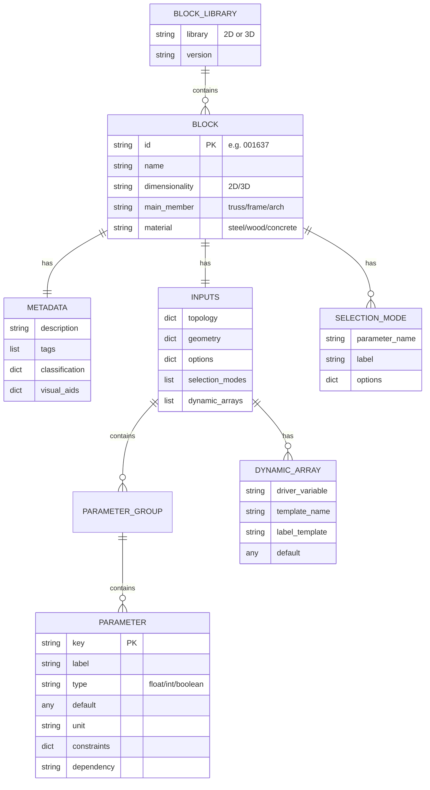

## 8. Code Generation Pipeline

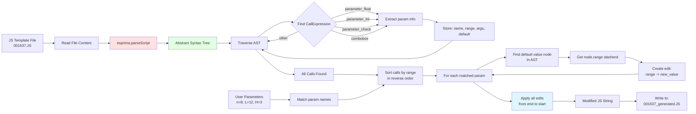

## 9. Request/Response Flow

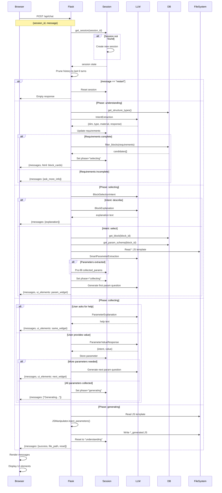

## 10. Deployment Architecture (Current vs Recommended)

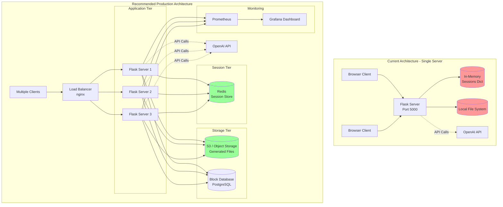

## 11. Security Architecture (Issues & Fixes)

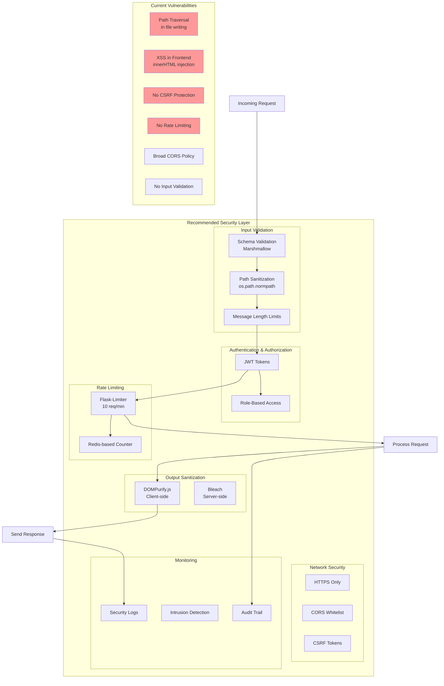

---

## Architecture Summary Table

| Component | Technology | Purpose | Status |
|-----------|-----------|---------|--------|
| **Frontend** | HTML/JS/CSS | User Interface | ✅ Complete |
| **Web Framework** | Flask | HTTP Server | ✅ Working |
| **Session Management** | In-Memory Dict | State Persistence | ⚠️ Needs Redis |
| **LLM Client** | LangChain | AI Integration | ✅ Working |
| **LLM Provider** | OpenAI GPT-4o | Natural Language Processing | ✅ Working |
| **Database** | JSON Files | Block Storage | ⚠️ Consider PostgreSQL |
| **Code Generator** | esprima + Custom | JS Manipulation | ✅ Working |
| **File Storage** | Local Filesystem | Generated Files | ⚠️ Consider S3 |
| **Logging** | None | Debugging | ❌ Missing |
| **Monitoring** | None | System Health | ❌ Missing |
| **Testing** | None | Quality Assurance | ❌ Missing |
| **Security** | Basic | Protection | ❌ Inadequate |

---

## Key Architectural Decisions

### 1. **Stateful Session Management**
- **Decision:** Use in-memory dictionary keyed by session_id
- **Rationale:** Simple for prototype, fast access
- **Trade-off:** Doesn't scale, loses data on restart
- **Recommendation:** Migrate to Redis

### 2. **Phase-Based State Machine**
- **Decision:** Four distinct phases (understanding → selecting → collecting → generating)
- **Rationale:** Clear conversation flow, easy to reason about
- **Trade-off:** Rigid, hard to support non-linear conversations
- **Status:** ✅ Good choice for current use case

### 3. **LLM-Powered Intent Classification**
- **Decision:** Use structured outputs for every user input interpretation
- **Rationale:** Flexible, handles natural language variations
- **Trade-off:** Slower, costs per request, needs error handling
- **Status:** ✅ Innovative and effective

### 4. **JSON-Based Block Database**
- **Decision:** Store blocks in static JSON files
- **Rationale:** Easy to version control, human-readable
- **Trade-off:** No ACID guarantees, no complex queries
- **Recommendation:** Fine for read-only data, consider PostgreSQL for user data

### 5. **AST-Based Code Generation**
- **Decision:** Parse JS with esprima, modify AST nodes
- **Rationale:** Robust, syntax-aware manipulation
- **Trade-off:** Complex, language-specific
- **Status:** ✅ Solid approach

---

## Scaling Considerations

### Current Bottlenecks:
1. **LLM API calls** (1-3 seconds each) - Critical path
2. **In-memory sessions** - Single point of failure
3. **No caching** - Repeated queries waste resources
4. **Synchronous processing** - Blocks other requests

### Scaling Strategy:
```
Phase 1 (1-100 users):
- Add Redis for sessions
- Implement LRU cache for blocks
- Add basic monitoring

Phase 2 (100-1000 users):
- Deploy multiple Flask instances
- Add load balancer
- Implement async LLM calls
- Cache LLM responses for common queries

Phase 3 (1000+ users):
- Microservices architecture
- Dedicated LLM service
- CDN for static assets
- Database for analytics
```