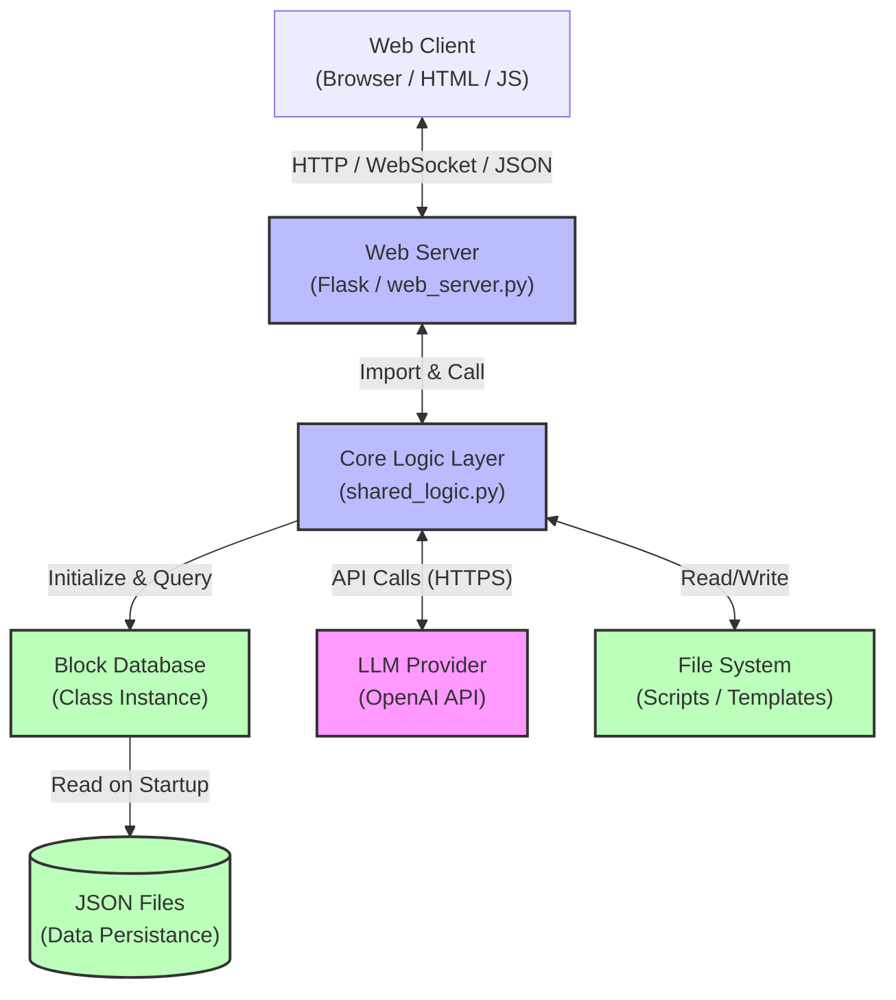
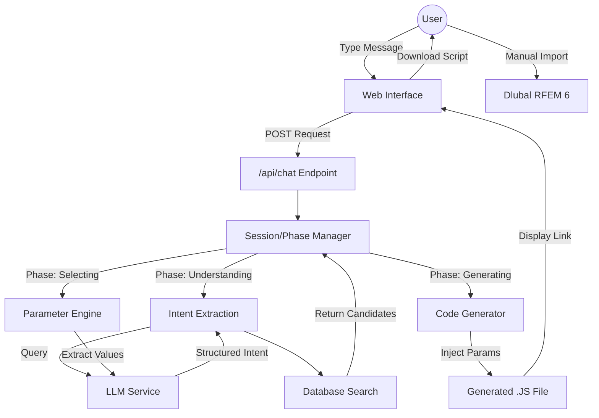
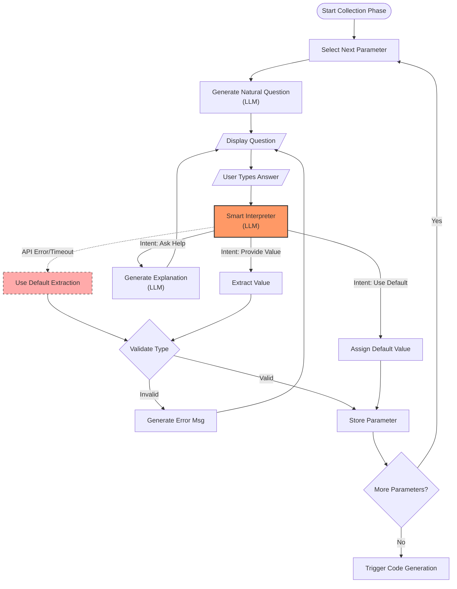
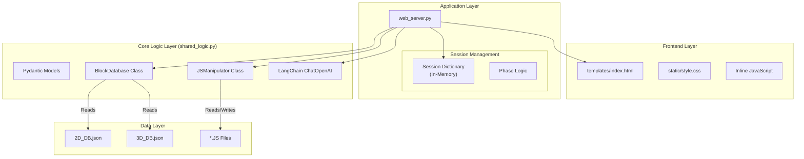
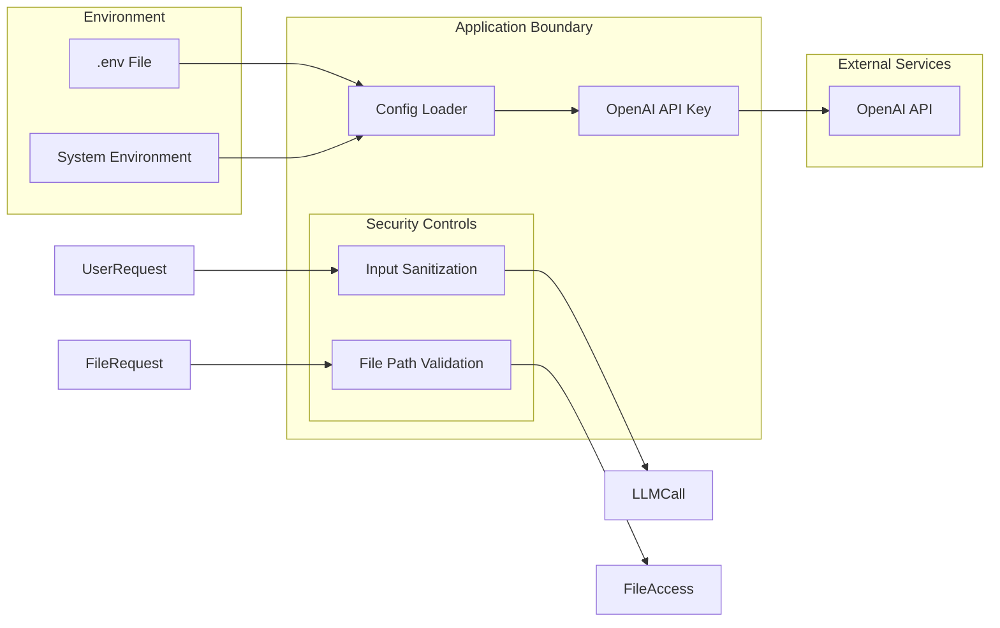
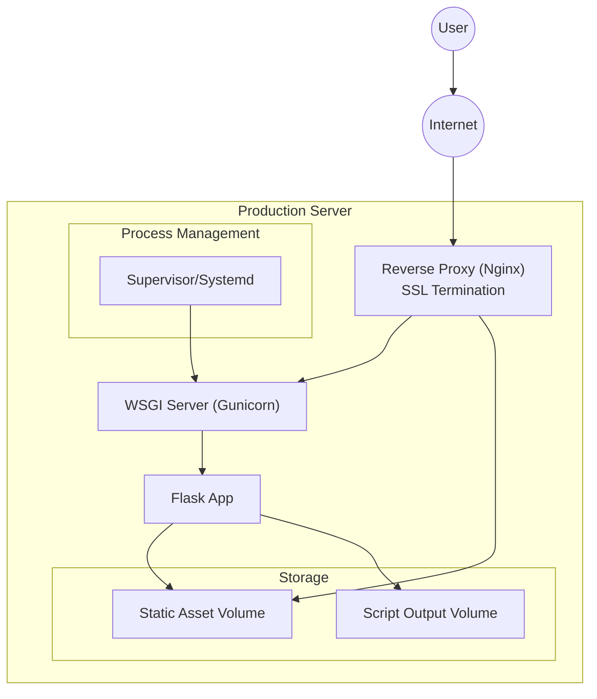
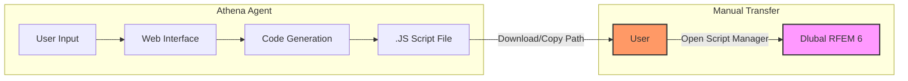
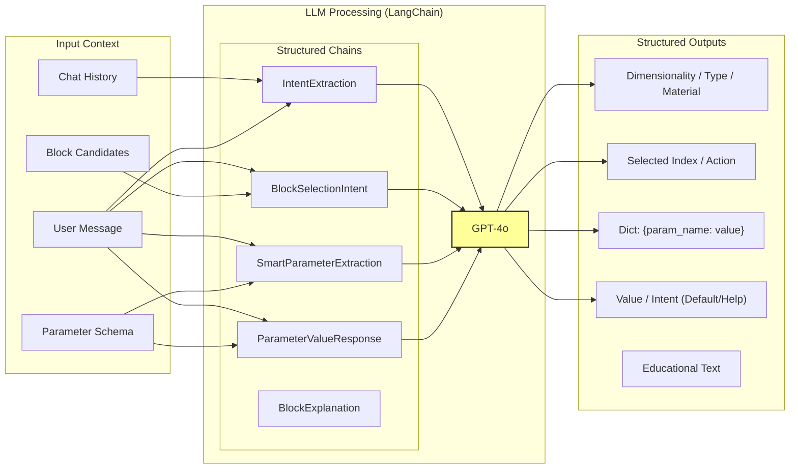

# Athena RFEM Agent - Architecture Documentation

This document outlines the architecture of the Athena RFEM Agent, a system designed to generate structural engineering blocks for Dlubal RFEM 6 using natural language interactions.

## 1. System Architecture

The system follows a client-server architecture with separation between the web frontend, backend logic, and persistent storage.

## 2. Data Flow Architecture

This diagram illustrates the lifecycle of a user request, highlighting the phase-based orchestration.

## 3. Parameter Collection & Error Handling

The "Smart Parameter Collection" loop includes validation and fallback strategies for robust user interaction.

## 4. Component Architecture

Breakdown of code organization, standardizing module names.

## 5. Security & Configuration Architecture

Overview of security boundaries and configuration management.

## 6. Deployment Architecture

Recommended setup for production deployment.

## Scalability Considerations

- **Session State**: Currently stored in-memory (`sessions` dictionary). For horizontal scaling, this should be moved to an external store (Redis/Memcached).
- **Concurrent Users**: Flask's built-in server is single-threaded by default. Production deployment requires valid WSGI (Gunicorn/uWSGI) with multiple workers.
- **File System**: Generated scripts are local. In a distributed environment, a shared volume or cloud storage (S3) would be required.
- **LLM Latency**: Heavy reliance on synchronous LLM calls. Consider background job queues (Celery/Redis Queue) for long-running generation tasks.

## 7. User Workflow (Manual Import)

This diagram explicitly differentiates the automated parts of the system from the manual steps required by the user.

## 8. LLM Integration Architecture

The system leverages structured outputs (JSON enforcement) to turn natural language into executable data.

